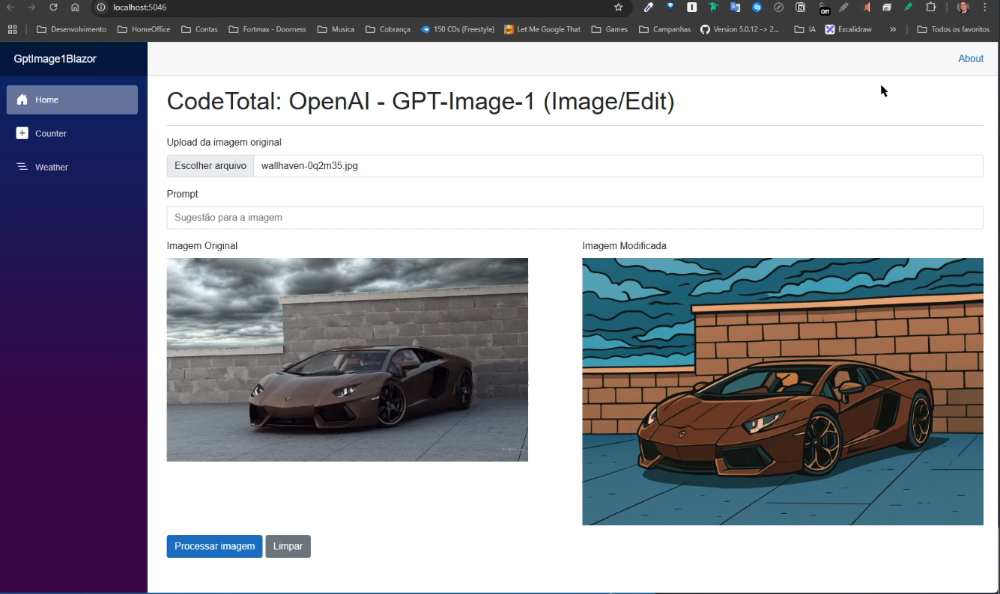

# GPT-IMAGE-1-EDIT

Blazor application for testing OpenAI's Image API (Image/Edit) using the `gpt-image-1` model.

## Completed Features:

- Upload of the original image
- Sending the image to the OpenAI API
- Displaying the processed image as Base64

## Pending Tasks:

- Wait for the update of the component to support the correct DTO parameters
- Implement mask submission to enable more precise modifications

## Challenges:

- Implement OAuth2 authentication with the OpenAI API